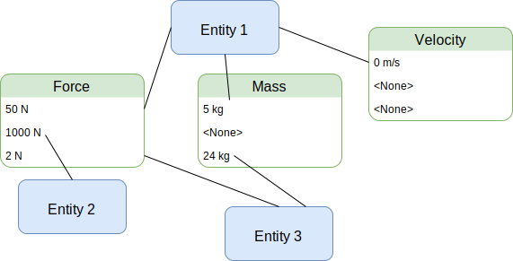
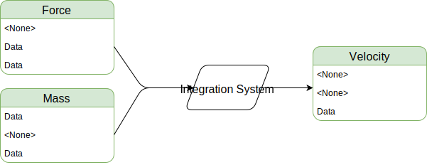

# はじめに

**The Specs Book** へようこそ！この本は、[ECS] および Specs API の入門書です。  
この本は初心者向けに書かれており、ECS を用いたゲームのセットアップ、構築、構造化におけるあらゆる困難を解決する手助けをします。

[ECS]: https://ja.wikipedia.org/wiki/エンティティコンポーネントシステム

**Specs** は、並列システム実行を可能にする ECS ライブラリであり、低オーバーヘッドかつ高い柔軟性を備えています。さまざまなストレージ形式をサポートし、型レベルのシステムデータモデルを提供します。  
主にゲームやシミュレーションで使用され、**継承** よりも **コンポジション（構成）** を重視したコード構造を実現できます。

追加のドキュメントは `docs.rs` で参照できます。

- [Specs の API ドキュメント](https://docs.rs/specs)

まだ **ECS** が何なのか分からない？ それなら、次のセクションを読んでみてください！  
すでに知っている場合は、このセクションをスキップしても構いません。

---

## ECS とは？

**ECS** とは、**Entity-Component-System**（エンティティ・コンポーネント・システム）の略称です。  
これは以下の 3 つの概念で構成されています。

- **エンティティ（Entity）**：いくつかの **コンポーネント（Component）** を持つオブジェクト。
- **コンポーネント（Component）**：エンティティに紐づくデータ。
- **システム（System）**：エンティティとコンポーネントを処理し、動作を実装する。

このように、データ（コンポーネント）と振る舞い（システム）を完全に分離できます。  
エンティティは単にコンポーネントのグループであり、例えば `Velocity`（速度）コンポーネントを `Position`（位置）コンポーネントに適用できます。

ECS は **オブジェクト指向プログラミング（OOP）** の対極にあると見なされることがあります。  
完全にそうとは言えませんが、いくつか比較してみましょう。

### OOP における問題点

OOP では、例えばプレイヤーのクラスは次のように定義されるかもしれません（Java を使用）：

```java
public class Player extends Character {
    private final Transform transform;
    private final Inventory inventory;
}
```

しかし、この設計にはいくつかの問題があります。

- **多重継承ができない**（もしくは [ダイヤモンド問題][dp] などの課題を引き起こす）。
  - 「プレイヤーは **コライダーである** のか、それとも **コライダーを持っている** のか？」という設計上の問題も発生する。
- **拡張が困難**：モッディング（改造）しようとしても、属性がすべてハードコードされている。
- **NPC を追加する際の問題**：
  
[dp]: https://en.wikipedia.org/wiki/Multiple_inheritance#The_diamond_problem

```java
public class Npc extends Character {
    private final Transform transform;
    private final Inventory inventory;
    private final boolean isFriendly;
}
```

このように、**Player** と **NPC** のコードがほぼ重複してしまう。  
例えば `transform`（座標情報）を両者が持っているが、コードの再利用が難しい。


---

### ECS による解決

ECS を用いると、**コンポーネントはエンティティに関連付けられるだけ** となる。  
つまり、必要に応じてコンポーネントを追加・削除するだけでよい。  
エンティティは単なる **ID** にすぎず、コンポーネントのテーブルにアクセスするためのキーとして扱われる。

理論的には、エンティティとそのコンポーネントをすべて一緒に保存することも可能だが、それでは効率が悪くなる。  
そのため、コンポーネントはテーブルに分けて管理される（詳細は [第 5 章][chapter 5] で解説）。

エンティティは単なる次のような構造体として実装される：

```rust,ignore
struct Entity(u32, Generation);
```

- **最初のフィールド**：ID（エンティティを一意に識別）
- **第二のフィールド**：世代（エンティティが削除されたかどうかの管理）

次の図は、コンポーネントとエンティティの関係を示している。  
ここで、`Force`（力）、`Mass`（質量）、`Velocity`（速度）はすべてコンポーネントである。

[chapter 5]: ./05_storages.html



- `Entity 1` は `Force`、`Mass`、`Velocity` のすべてを持っている。
- `Entity 2` は `Force` だけを持っている。

---

## システム（System）

ECS の **最後の要素 "S"**（システム）について説明しよう。  
**コンポーネント** と **エンティティ** は純粋なデータに過ぎないが、  
**システム（System）はアプリケーションのロジックを持つ**。

システムは通常、「**特定の条件を満たすエンティティすべてを処理する**」ように設計される。  
例えば「`Force` と `Mass` を両方持つエンティティ」を対象にして、`Velocity` を計算する、という形で動作する。

これが OOP における **Player / NPC の例** との大きな違いである。  
ECS では、単にエンティティに属性を追加することで、新たな振る舞いを定義できる。  
この考え方は **データ駆動型プログラミング（[data-driven]）** と呼ばれる。

[data-driven]: https://en.wikipedia.org/wiki/Data-driven_programming



例えば、エンティティに `Force` を追加すると、それが `Mass` と組み合わさり、自動的に `Velocity` が生成される。  
つまり、「質量を持つエンティティに力を加えると動く」ことになる。

---

## ECS を使うべき場面は？

もし「データ指向プログラミングを行うための一般的なライブラリ」を探しているなら、ECS は適していないかもしれない。  
ECS は **ゲームやシミュレーション** に特化したアーキテクチャであり、それだけでコードをデータ指向にするわけではない。

---

以上が概要だ。  
次は [第 2 章][c2] で、**Specs を使った最初のアプリケーション** を構築してみよう。

[c2]: ./02_hello_world.html